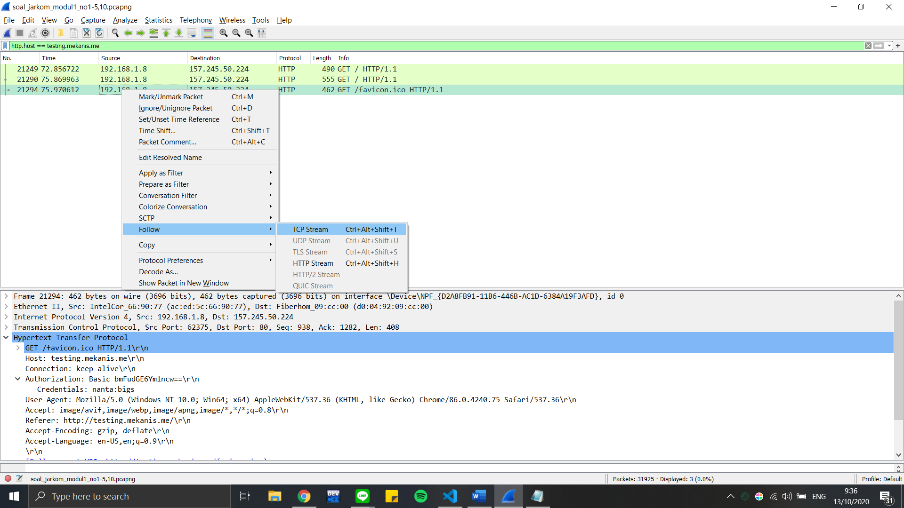
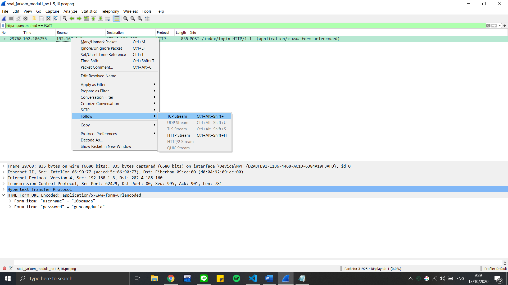

# Lapres Modul 1 Jarkom T02 2020

### Oleh:
- Muhammad Sulthon Nashir (0511174000017)
- Bagas Immanuel Lodianto (05311840000026)

### Display Filter
#### No. 1
Sebutkan webserver yang digunakan ketika mengakses "testing.mekanis.me"!
##### Penyelesaian
Gunakan filter :
```
http.host == testing.mekanis.me
```



Lalu follow TCP Stream


#### No. 2
Simpan gambar "Tim_Kunjungan_Kerja_BAKN_DPR_RI_ke_Sukabumi141436.jpg"!

##### Penyelesaian
Filter dengan
```
HTTP
```
Lalu
```
Export Object >> http
```
Cari file gambar yang dimaksud, Save.

#### No. 3
Cari username dan password ketika login di "ppid.dpr.go.id"!

##### Penyelesaian
Gunakan filter :
```
http.request.method == POST
```



Lalu follow TCP Stream


#### No. 4
Temukan paket dari web-web yang menggunakan basic authentication method!

##### Penyelesaian
Gunakan filter :
```
HTTP
```


Karena semua website HTTP masih menggunakan basic authentication

#### No. 5
Ikuti perintah di aku.pengen.pw! Username dan password bisa didapatkan dari file .pcapng!

##### Penyelesaian
Gunakan filter packet :
```
(ip.dst == 157.245.50.224 || ip.src == 157.245.50.224) && http
```


Maka didapatkan username dan Password


Lalu lakukan sesuai perintah


#### No. 6
Seseorang menyimpan file zip melalui FTP dengan nama "Answer.zip". Simpan dan Buka file "Open This.pdf" di Answer.zip. Untuk mendapatkan password zipnya, temukan dalam file zipkey.txt (passwordnya adalah isi dari file txt tersebut).

##### Penyelesaian
Gunakan filter
```
ftp-data
```
Pilih "Answer.zip", show and save data as "Raw", Save.

Lalu follow zipkey.txt, itu passwordnya.

#### No. 7
Ada 500 file zip yang disimpan ke FTP Server dengan nama 1.zip, 2.zip, ..., 500.zip. Salah satunya berisi pdf yang berisi puisi. Simpan dan Buka file pdf tersebut.
Your Super Mega Ultra Rare Hint = nama pdf-nya "Yes.pdf".

##### Penyelesaian
Gunakan filter :
```
ftp-data contains "Yes.pdf"
```
Follow stream file yang masuk akal, lalu save as raw seperti biasa.

#### No. 8
Cari objek apa saja yang didownload (RETR) dari koneksi FTP dengan Microsoft FTP Service!

##### Penyelesaian
Gunakan filter :
```
ftp.request.command == RETR
```
Follow satu persatu, cek file yang menggunakan Microsoft FTP Service.

#### No. 9
Cari username dan password ketika login FTP pada localhost!

#### Penyelesaian
Gunakan filter :
```
ftp.request.command == USER || ftp.request.command == PASS
```
#### No. 10
Cari file .pdf di wireshark lalu download dan buka file tersebut!
clue: "25 50 44 46"

##### Penyelesaian
Gunakan filter :
```
http contains ".pdf"
```
Follow stream, lalu save bagian TCP Payload

### Capture Filter

#### No. 11
Filter sehingga wireshark hanya mengambil paket yang mengandung port 21!

##### Penyelesaian
Gunakan Capture Filter : 
```
port 21
```


#### No. 12
Filter sehingga wireshark hanya mengambil paket yang berasal dari port 80!

##### Penyelesaian
Gunakan Capture Filter : 
```
src port 21
```


#### No. 13
Filter sehingga wireshark hanya mengambil paket yang menuju  port 443!

##### Penyelesaian
Gunakan Capture Filter : 
```
dst port 443
```


#### No. 14
Filter sehingga wireshark hanya mengambil paket yang berasal dari ip kalian!

##### Penyelesaian
Pertama cari IP address anda terlebih dahulu lalu lakukan capture ip.address = ` ip address anda`
```
src 36.68.219.141
```


#### No. 15
Filter sehingga wireshark hanya mengambil paket yang tujuannya ke monta.if.its.ac.id!

##### Penyelesaian
Capture filter dengan tujuan monta.if.its.ac.id
```
dst monta.if.its.ac.id
```


